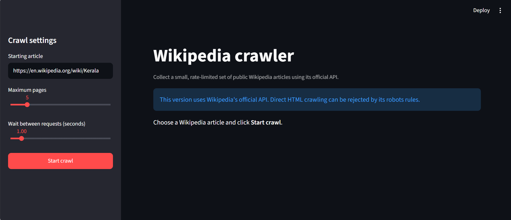
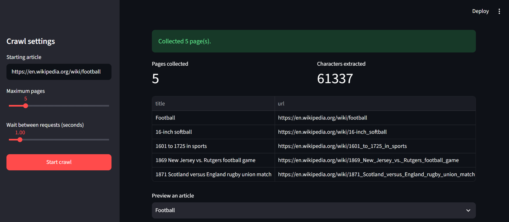
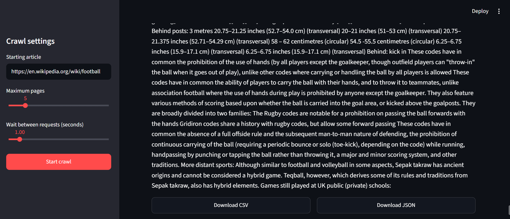

# Wikipedia crawling project

This project demonstrates the core ideas behind responsible web crawling:

- begin with one URL;
- check `robots.txt` before requesting a page;
- crawl only the same site's standard article URLs;
- limit the total number of pages;
- wait between requests;
- save structured results for analysis.

## Run it

The command-line crawler needs Python 3.10+ and no third-party packages.

```powershell
python .\wikipedia_crawler.py --max-pages 10 --delay 1
```

To begin at another English Wikipedia article:

```powershell
python .\wikipedia_crawler.py --start "https://en.wikipedia.org/wiki/Web_crawler" --max-pages 5
```

The script writes these files to `outputs/`:

- `wikipedia_pages.json` — headings and full extracted paragraph text as structured records.
- `wikipedia_pages.csv` — the same information in a spreadsheet-friendly format.

## Use the simple web interface

The Streamlit interface lets you choose the starting URL, page limit, and wait time; preview the collected records; and download the results.

Install its two UI dependencies, then start it:

```powershell
python -m pip install streamlit pandas or python -m pip install -r requirements.txt
python -m streamlit run .\app.py
```

Your browser will open a local address (usually `http://localhost:8501`).

## How it works

1. It normalizes the starting URL and accepts only `https://en.wikipedia.org/wiki/...` article URLs.
2. It downloads and consults Wikipedia's `robots.txt` rules.
3. It keeps a queue of discovered links and a set of URLs already considered.
4. For each permitted page, it extracts the page title, headings, paragraphs, and more internal article links.
5. It waits after every successful request, then stops at the page limit and saves results.

## Boundaries

Do not remove the rate limit, evade website controls, crawl account-only pages, or collect sensitive personal data. For production work, check the site's terms and use an official API when available.


## Screenshots

### 


